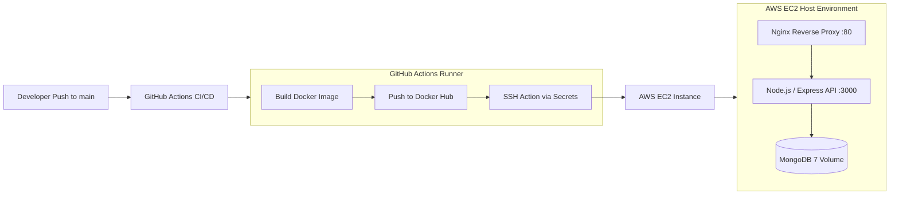

# Automated AWS EC2 Deployment Pipeline

[](https://github.com/Bedru-Mekiyu/first-CI-CD/actions/workflows/deploy.yml)
[](https://www.docker.com/)
[](https://nginx.org/)
[](https://aws.amazon.com/ec2/)
[](https://nodejs.org/)
[](https://www.mongodb.com/)

A production-oriented containerized continuous integration and deployment (CI/CD) pipeline. On every commit to `main`, GitHub Actions builds and publishes a Docker image to Docker Hub, then automatically establishes a secure SSH connection to an **AWS EC2** instance to pull the image and restart the multi-container stack via **Docker Compose** behind an **Nginx** reverse proxy.

---

## 🏗️ Architecture



### Infrastructure Components

1. **GitHub Actions CI/CD Pipeline (`.github/workflows/deploy.yml`)**:
   - Triggers automatically on push events to the `main` branch.
   - Authenticates to Docker Hub using repository secrets (`DOCKER_USERNAME`, `DOCKER_PASSWORD`).
   - Builds the production Docker image and pushes it to Docker Hub.
   - Executes remote deployment via `appleboy/ssh-action` connecting to AWS EC2 using SSH private key authentication (`EC2_HOST`, `EC2_SSH_KEY`).
   - Ensures Docker and Docker Compose prerequisites on the host, pulls the latest repository assets, generates the runtime `.env`, pulls the fresh image, and performs a zero-downtime container recreation (`docker-compose up -d`).

2. **Reverse Proxy & Web Server (`nginx.conf`)**:
   - Exposes public HTTP port `80` with upstream pass-through to the `app:3000` internal container.
   - Configured with `server_tokens off` for security header masking.
   - Implements HTTP/1.1 persistent connections and WebSocket upgrade headers (`Upgrade`, `Connection: "upgrade"`).
   - Preserves client IP propagation via `X-Real-IP` and `X-Forwarded-For`.

3. **Application Layer (`app.js`)**:
   - Built on Node.js and Express.
   - Enforces defense-in-depth HTTP security headers via **Helmet**.
   - Request rate limiting via **express-rate-limit** (100 requests per 15-minute window).
   - Dynamic Mongoose database connection lifecycle management.
   - Container healthcheck (`wget -qO- http://localhost:3000 || exit 1`) ensuring healthy rolling restarts.

4. **Persistence Layer**:
   - MongoDB 7 container attached to an isolated internal Docker bridge network (`app-network`).
   - Persistent Docker named volume (`mongo-data`) protecting database state across deployments.

---

## 📁 Repository Structure

```text
first-CI-CD/
├── .github/
│   └── workflows/
│       └── deploy.yml          # GitHub Actions CI/CD pipeline
├── .dockerignore
├── .env.example                # Template for environment configuration
├── .gitignore
├── Dockerfile                  # Multi-layer Docker image definition
├── app.js                      # Express server entry point with Helmet & Rate Limiting
├── docker-compose.yml          # Multi-container orchestration (App, Mongo, Nginx)
├── nginx.conf                  # Nginx reverse proxy configuration
├── package.json
└── README.md
```

---

## 🚀 Local Development

### Prerequisites

- [Docker](https://docs.docker.com/get-docker/) & [Docker Compose](https://docs.docker.com/compose/)
- [Node.js](https://nodejs.org/) (v18+)

### Running Locally with Docker Compose

1. **Clone the repository:**
   ```bash
   git clone https://github.com/Bedru-Mekiyu/first-CI-CD.git
   cd first-CI-CD
   ```

2. **Configure environment:**
   ```bash
   cp .env.example .env
   ```

3. **Start the multi-container stack:**
   ```bash
   docker-compose up --build -d
   ```

4. **Verify services:**
   - Public Nginx endpoint: `http://localhost:80`
   - View container status: `docker-compose ps`
   - Stream container logs: `docker-compose logs -f`

5. **Stop services:**
   ```bash
   docker-compose down
   ```

---

## 🔐 Environment & Secret Configuration

### Local Environment (`.env`)

| Variable | Default Value | Description |
|---|---|---|
| `PORT` | `3000` | Port Express listens on inside the container |
| `MONGO_URI` | `mongodb://mongo:27017/mydb` | Internal Docker network MongoDB connection URI |
| `JWT_SECRET` | `your_jwt_secret_key_here` | Secret key for token signing |

### GitHub Actions Secrets

To enable automated EC2 deployment, configure the following repository secrets under **Settings > Secrets and variables > Actions**:

| Secret Name | Description |
|---|---|
| `DOCKER_USERNAME` | Docker Hub username |
| `DOCKER_PASSWORD` | Docker Hub access token or password |
| `EC2_HOST` | Public IP or DNS of the AWS EC2 instance |
| `EC2_SSH_KEY` | Private SSH key (PEM format) with access to the EC2 host |
| `MONGO_URI` | Production MongoDB connection string |
| `JWT_SECRET` | Production JWT secret key |

---

## 📜 License & Author

Developed by **[Bedru Mekiyu](https://github.com/Bedru-Mekiyu)**.  
Licensed under the [MIT License](LICENSE).
